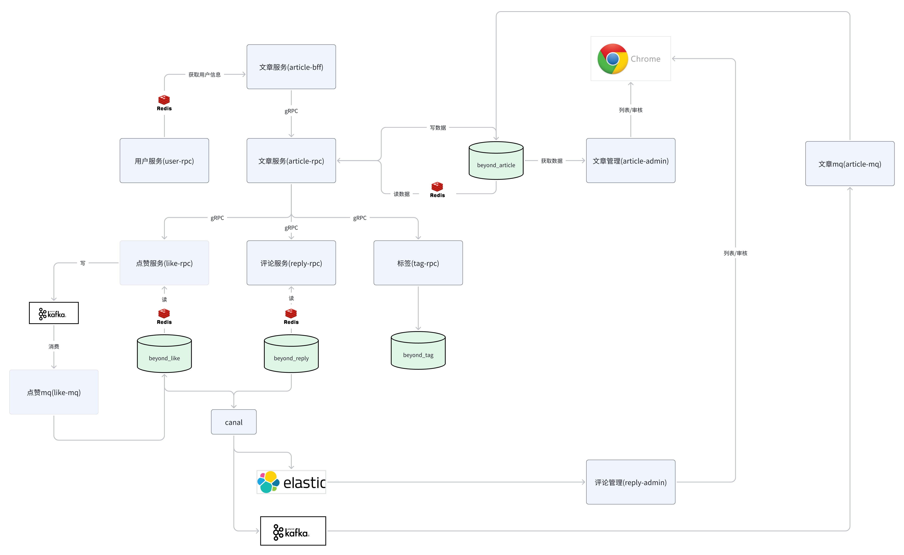

## 服务拆分
服务采用垂直架构拆分，目录结构
```shell
./
├── README.md
├── application 微服务目录
│   ├── applet  BFF服务(api)
│   ├── article  文章
│   ├── chat  聊天
│   ├── concerned  关注
│   ├── member  会员
│   ├── message  消息
│   ├── qa  问答
│   └── user  用户
├── db  sql文件
│   └── user.sql
├── go.mod
├── go.sum
└── pkg  微服务共同依赖的方法
    ├── encrypt
    ├── jwt
    ├── xcode
    ├── consul
    └── util
    
```

## 业务错误处理

go-zero的处理方式不能满足需求，需要通过自定义业务错误处理来实现，本项目中具体代码实现在pkg.xcode下。

业务错误码在开发项目中是非常重要的，标准的http状态码往往不带有业务属性，客户端很难通过标准的http状态码做业务逻辑处理。 注意，业务错误码千万不能冲突，一定要协调好

### 注册自定义错误逻辑

api中，错误处理在主函数中通过`httpx.SetErrorHandler(xcode.ErrHandler)`将自定义的业务错误处理逻辑注册进来。

### 拦截器

远程过程调用时，rpc中发现的业务错误需要传给api，此时需要使用拦截器。BFF的API服务请求RPC服务时会经历两个拦截器，即客户端和服务端的拦截器。

#### 服务端rpc的拦截器

rpc中，由于rpc无法正常使用错误码，会报500错误，所以需要拦截器。在rpc的主函数中使用自定义的拦截器：

```go
s.AddUnaryInterceptors(interceptors.ServerErrorInterceptor())
```

拦截器会获取正常业务处理对应的rpc方法的处理结果（即自定义的错误），将其转换成grpc的错误，并把详细的错误信息封装到detail中（通过status.Status.WithDetails()），然后返回给服务调用方。

#### 客户端api的拦截器

api中，就需要将翻译成grpc的错误码再翻译回自定义的错误码。

在internal.svc中注册:

```go
userRPC := zrpc.MustNewClient(c.UserRPC, zrpc.WithUnaryClientInterceptor(interceptors.ClientErrorInterceptor()))
```

该拦截器会从gRPC的错误中拿到detail，把detail中的业务自定义错误信息转换成错误码，通过自定义的错误方法返回。


#### 定义错误码

在internal文件夹下创建code.go文件夹存放错误码

## 具体功能实现

### 文章功能



- 文章服务：核心
  - 通过article-bff提供对外接口
  - 依赖于用户服务
  - 文章发布后写入wg_zhihu_article数据库，同时通过缓存来读取。
- 管理后台通过文章管理服务审核数据库中的文章
- 文章服务与点赞、评论、标签服务相关联
  - 点赞服务包括评论的点赞，通过kafka异步写入数据库，通过redis读取
  - 评论通过缓存读取，通过评论管理服务审核，canal用于监听mysql变更写入到ES中

## 数据库设计

每个服务对应一个数据库，共有用户、文章、点赞、评论、标签表，具体设计在db文件夹内注释